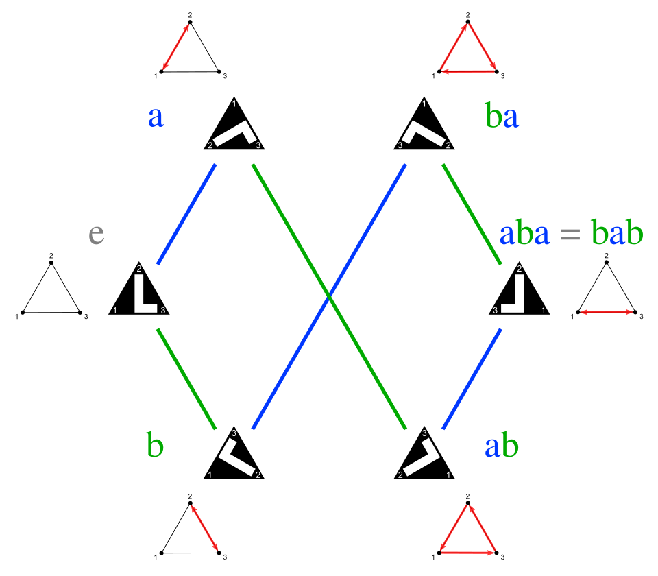

# Abstract-Algebra
Content is essentially based of my notes from the Colorado State University course MATH 366 (I was lucky to have it with one of my favorite professors), which enjoyed. There are several concepts which I found astonishing; these concepts will be explored more in the python notebooks. At the time I was writing the code, I was learning how to use Lean 4, for functional programming and checking proofs. This project also plays a role of my hello world for Lean.

Primary text: Abstract Algebra: Theory and Applications, by Thomas W. Judson.

### Guide
Start with the python notebooks. The modules are by the sections in my notes (not all of the chapters in the textbook are covered), it stats with definitions and theorems then elaborates examples. Definitions/theorems are shown in Lean. 

Table of contents:
- Modules
	- Foundations
	- Groups
	- Rings and Fields
- new_lean
	- AA_proofs.lean

Image from Wikipedia article [Dihedral group of order 6](https://en.wikipedia.org/wiki/Dihedral_group_of_order_6)